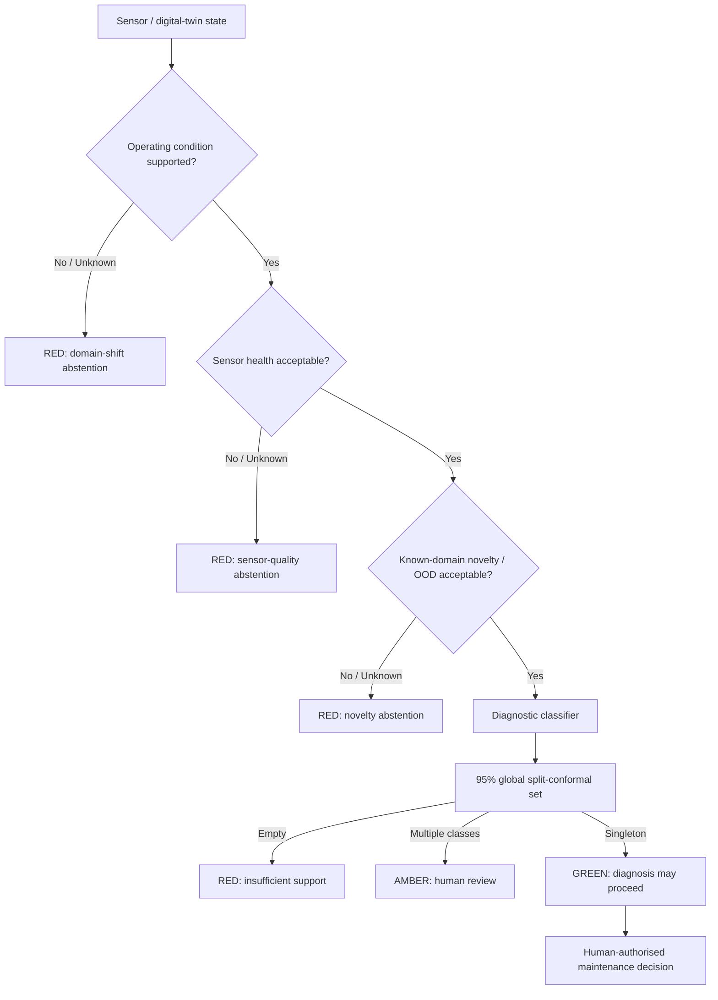

# TrustTwin AI

**TrustTwin AI** is a research framework for trustworthy fault diagnosis in industrial digital twins. It separates **diagnosis** from the evidence needed to decide whether that diagnosis should be trusted, reviewed, or withheld.

> **Research status:** experimental research software. Not safety-certified. Not an autonomous maintenance system.

## Research question

**How can an explainable and uncertainty-aware AI layer improve trustworthy fault diagnosis and risk-informed maintenance decision-making in an industrial digital twin when sensor quality and operating conditions degrade?**

## Frozen trust architecture



**GREEN does not mean guaranteed correct.** It means the current evidence gates permit the diagnosis to proceed to a human-facing workflow. TrustTwin does not autonomously prescribe or execute maintenance.

## Evidence-led conclusions

- Speed-normalised order + Hilbert-envelope features were more robust than fixed-Hz features across held-speed, multi-seed, resampling and condition-holdout experiments.
- Severe sensor corruption can produce **confidently wrong** diagnoses; classifier confidence is not a sensor-health substitute.
- Paired explanation instability is useful as an **offline robustness diagnostic**, but explanation prototypes failed as runtime trust gates.
- Predictive OOD evidence works well **inside represented operating conditions**, but fails under simultaneous operating-condition shift.
- Ordinary temperature scaling is rejected as the runtime trust probability.
- Global 95% split-conformal prediction is retained as the candidate **in-domain abstention mechanism**.
- Unsynchronised vibration + one-phase-current late fusion did **not** outperform vibration alone.
- The workflow was reproduced on an independent UCI hydraulic test-rig dataset; review burden increased sharply when diagnostic competence was poor.

See [claim/evidence matrix](docs/claim_evidence_matrix.md) and [verified results summary](docs/results_summary.md).

## Repository map

```text
src/trusttwin/              Deterministic runtime decision policy
tests/                      Unit tests
cli/                        JSON command-line runner
configs/                    Frozen runtime policy
schemas/                    Machine-readable input/output schemas
experiments/                Experiment registry and phase provenance
results/verified/           Public-release result index
provenance/                 SHA-256 ledgers for original result bundles
docs/                       Research design, evidence, limitations, reproducibility
```

Raw datasets and large result bundles are intentionally **not committed**.

## Quick start

```bash
python -m unittest discover -s tests -v
python cli/run_decision_engine.py examples/green_example.json
```

## Interactive research demonstrator

Phase 9C adds a local browser-based **TrustTwin Digital Twin Trust Console**. The browser sends evidence to a Python HTTP service that imports the frozen `trusttwin.decision_engine`; GREEN/AMBER/RED decisions therefore come from the same policy code used by the research package.

```bash
python demo/server.py
```

Then open `http://127.0.0.1:8000`.

The included scenarios are simulated demonstrations of research-observed regimes. Their probability vectors are explicitly illustrative; the associated evidence notes point to verified phase findings.

See [demo/README.md](demo/README.md) and [docs/demonstrator.md](docs/demonstrator.md).

## Datasets

Primary development dataset:

- **NLN-EMP — Motor Current and Vibration Monitoring Dataset for various Faults in an E-motor-driven Centrifugal Pump**
- DOI: `10.4121/2b61183e-c14f-4131-829b-cc4822c369d0.v4`

Independent workflow-replication dataset:

- **UCI Condition Monitoring of Hydraulic Systems**
- DOI: `10.24432/C5CW21`

Datasets are not redistributed here.

## Research integrity

TrustTwin intentionally preserves failed hypotheses and negative experiments. It does not claim a universal trust probability, zero-error operation, safety certification, causal explanations, or autonomous maintenance authority.

## Citation

See [CITATION.cff](CITATION.cff).

## Licence

Research software is released under the MIT License. Dataset terms remain those of the original providers.
